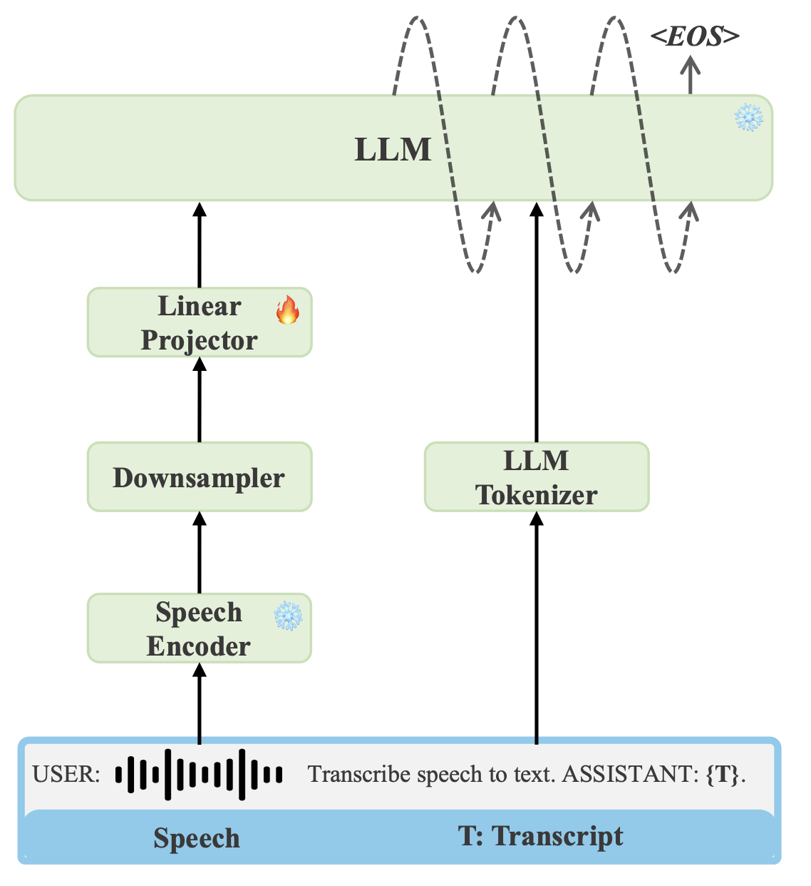

# asr_with_llm

## About

Implemnetation of [An Embarrassingly Simple Approach for LLM with Strong ASR Capacity](https://arxiv.org/abs/2402.08846) (Ma+, 2024)



This implementation uses:

- `openai/whisper-small` as the audio encoder
- `sbintuitions/sarashina2.2-1b-instruct-v0.1` as the text decoder

### Data

- [日本語話し言葉コーパス (CSJ)](https://clrd.ninjal.ac.jp/csj/)

## Installation

```console
uv sync
```

## How to reproduce

### Data

set CSJ data following the instruction of `input/README.md`

### train

```console
python -m src.scripts.train
```

### test

```console
python -m src.scripts.test --ckpt /path/to/checkpoint
```

## Metrics (CER)

| Speech Encoder | LLM | eval1 (dev) | eval2 (test) | eval3 (test) |
| ------------- | ------------ | ----------- | ------------ | ------------ |
| [openai/whisper-small](https://huggingface.co/openai/whisper-small) | [sbintuitions/sarashina2.2-1b-instruct-v0.1](https://huggingface.co/sbintuitions/sarashina2.2-3b-instruct-v0.1) | 8.54 | 6.44 | 7.18 |
